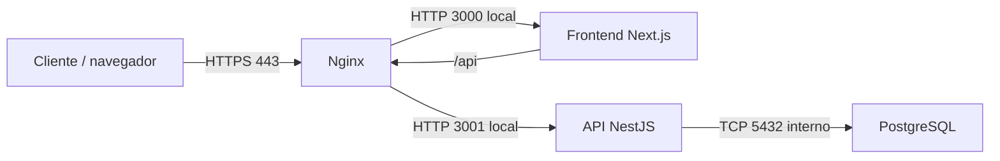

# Jeroky Soft - TP Integrador de Arquitectura Web

Repositorio de evidencias, configuraciones e informe técnico del Trabajo Práctico
Integrador de Electiva III - Arquitectura Web, FP-UNA, segundo semestre 2026.

## Objetivo

Demostrar de forma reproducible la selección, instalación, publicación y
verificación de Jeroky Soft en una máquina virtual GNU/Linux, considerando
arquitectura, conectividad, HTTP/HTTPS, rendimiento, seguridad y resiliencia.

## Aplicación seleccionada

| Componente | Repositorio | Rama |
|---|---|---|
| Backend | [jerokybackend](https://github.com/marilenebntz/jerokybackend/tree/release/1) | `release/1` |
| Frontend | [jerokyfrontend](https://github.com/marilenebntz/jerokyfrontend/tree/release/1) | `release/1` |

Ambos componentes se distribuyen bajo licencia MIT.

## Arquitectura desplegada



Nginx es el único punto de entrada web. Termina TLS, redirige HTTP a HTTPS,
agrega cabeceras de seguridad y distribuye las solicitudes al frontend o a la
API. Los puertos 3000 y 3001 están enlazados a `127.0.0.1`; PostgreSQL no
publica el puerto 5432 en la VM.

## Hitos

| Hito | Alcance | Estado |
|---|---|---|
| Hito 1 | Selección, arquitectura, VM y línea base | **Completo** |
| Hito 2 | Instalación y publicación HTTP | **Completo** |
| Hito 3 | Nombre local, TLS y mediciones | **Completo** |
| Hito 4 | Seguridad, resiliencia y prueba de carga | **Completo** |

El cierre del Hito 4 está documentado en
[`docs/hito-4-seguridad-resiliencia.md`](docs/hito-4-seguridad-resiliencia.md).

Commit desplegado: backend `0b8a878` / frontend `3b41d84` en `release/1`
(ver `docs/ficha-tecnica.md` para el hash completo).

## Organización

- `docs/`: ficha técnica, arquitectura y decisiones ADR.
- `evidencias/`: comandos, salidas, capturas e interpretación por fase.
- `config/`: configuraciones reproducibles sin secretos.
- `matriz/`: trazabilidad de las pruebas P01-P12.
- `scripts/`: comprobaciones, resiliencia, carga y monitoreo.
- `informe/`: ubicación del informe final.

## Ejecución rápida de las pruebas del Hito 4

En la VM:

```bash
cd ~/jeroky
bash /ruta/al/repositorio/scripts/hito4-smoke.sh
CONFIRM_OUTAGE=yes bash /ruta/al/repositorio/scripts/hito4-resiliencia.sh
```

En otra terminal de la VM, para monitorear:

```bash
bash /ruta/al/repositorio/scripts/hito4-recursos.sh
```

Desde el Mac anfitrión, para generar carga:

```bash
bash /ruta/al/repositorio/scripts/hito4-carga.sh
```

## Seguridad de la información

No se deben versionar contraseñas, tokens, claves privadas, archivos `.env`,
datos biométricos ni información personal real. Los certificados autofirmados
usados en el laboratorio no incluyen la clave privada en este repositorio.
