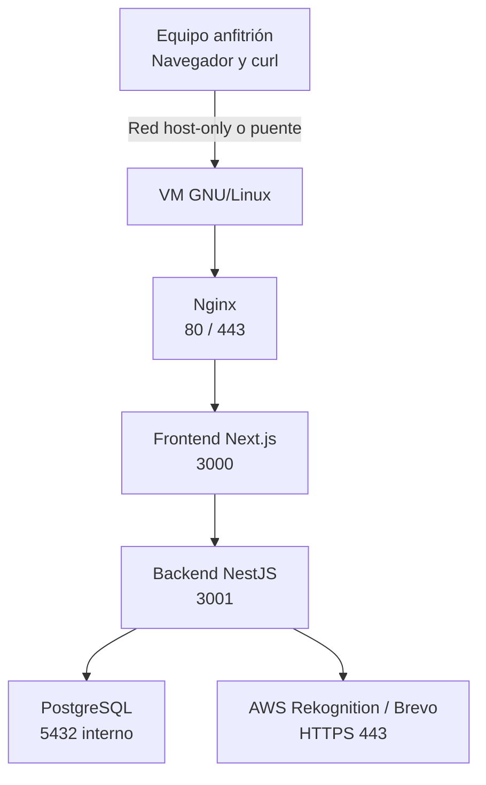

# Arquitectura lógica inicial

Este diagrama representa la hipótesis de despliegue que será validada y actualizada durante el TP.

## Recorrido previsto

1. El cliente resolverá un nombre local asociado a la IP de la VM.
2. La conexión ingresará por Nginx en 80 o 443.
3. Nginx publicará el frontend y redirigirá las solicitudes de API al backend.
4. El backend procesará la solicitud y accederá a PostgreSQL.
5. Cuando la función lo requiera, el backend se comunicará con servicios externos mediante HTTPS.
6. La respuesta recorrerá el camino inverso hasta el navegador.

## Criterios pendientes de validar

- Modalidad e interfaz de red de la VM.
- Dirección IP, máscara, gateway y DNS.
- Nombre local definitivo.
- Aislamiento del puerto 5432 y del puerto interno del backend.
- Configuración definitiva de Nginx y TLS.
